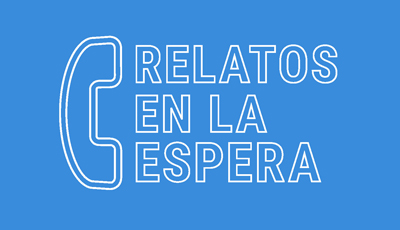

# Interactivos17-Relatos en la Espera  
Antes de empezar a movernos con el transporte público vivimos en la ‘espera’, en un tiempo muerto e insignificante. ¿Qué objeto, suceso o acontecimiento nos puede despertar del letargo de esa espera?

### Idea
Hoy en día los usuarios del transporte público suelen estar notificados del intervalo de espera. Un tiempo que hasta ahora está ocupado principalemte por el teléfono movil y la publicidad de las paradas. El proyecto aprovecha ese tiempo de una forma alternativa, involucra al viajero en una experiencia extraña pero enriquecedora que sirve para ampliar la lectura de la ciudad que le envuelve. La audición de un relato que dura el tiempo de espera previsto se convierte en el detonante para viajar con la imaginación sin moverse de la parada. 

### Implementación
##### Estado del Arte. 
Se ha hecho un rastreo de otros proyectos que se han desarrollado en torno al transporte público. Proyectos unas veces centrados en la lectura, en los anuncios que suelen estar en estas paradas o en lo que ocurren durante el vieje. Para localizar la propuesta de "Relatos en la Espera" en este entorno de referencias, se ha llevado a cabo un "Mapa de usuario" que permite reconocer todas las referencias estudiandas de bajo dos parámetros, nivel de relación con el factor tiempo de espera y nivel de importancia de la oralidad. 

XXXXXXXXXXXXXXXXXXXXXXXXXXXXXXXXXimagen del mapa XXXXXXXXXXXXXXXXXXXXXXXXXXXXXXXXXXXXx
referencias usadasXXXXXXXXXXXXXXXXXx

##### Tecnología: Se han barajado distintas tecnologías para llevar a cabo el dispositivo. Desde una App hasta un teléfono analógico que pudiera servir para escuchar los relatos. Dada la vinculación de la espera al lugar de donde se desarrolla, la tecnología del prototipo tendría que dar salida a este requisito. Por lo tanto la solución de una App no se vio factible por la deslocalización al lugar y el necesario consumo de datos que supondría trabajar con ella. A priori el uso de la tecnología "nearby" parecía la más optima, una vibración del movil personal cuando el viajero se acerca a la parada sería una buena solución para llevarlo a cabo, salgo que para el desarrollo del prototipo es exesivamente complejo. 

Por facilidad de ejecución se decide desarrollar una tecnología mixta. Un dispotivio que con apariencia de teléfono permitiera narrar las historias. Junto a el una pantalla con la que interaccionar para especificar el tiempo de espera que el usuario estima que va tardar el transporte.  

Explicar aquí cómo se ha hecho: materiales, procesos, conexiones, etc. 
(Nota: los textos explicativos han de ser claros y suficientes para que otra persona pudiera retomar este proyecto)
# Promotores y colaboradores: 
### Equipo: 
+ Katerina Psegiannaki (www.kuneoffice.com/)
+ Francisco García Triviño (http://www.kuneoffice.com/)
+ José Manuel López Ujaque (http://www.kuneoffice.com/)
### Colaboradores
+ Sandra Vivar Maestre (www.sandramind.design/)
+ Katalina Soto Rivera (https://www.behance.net/katakatasoto)
+ Mario Alejandro Alzate López (www.marioalzatelopez.com)
+ Inmanulada Marruecos Payán 
+ Marta Felipe Soria 
### Autores e Interpretadores de los textos
+ Manuel de la Cruz
+ Gonzalo Pendolema 
+ 

# Instrucciones
### Instrucciones de montaje y desmontaje
+ Qué material se necesita
+ Cómo se ensambla todo
+ En qué puntos hay que tener cuidado
### Instrucciones de funcionamiento
+ ¿Cómo se enciende? ¿Cómo se apaga?
+ ¿Qué hace exactamente? ¿Cómo interactuar con el dispositivo? (pensar que la gente que lo ve no ha estado en el taller). 
### Instrucciones de mantenimiento
+ ¿Tiene batería? ¿Cómo cargarla? ¿Cada cuanto?
+ ¿Utiliza materiales desechables? ¿tintas? ¿papel?
+ Si deja de funcionar cuál sería la lista de errores más corrientes: de los más comunes a los más raros. ¿Cómo arreglar cada uno?
# Recursos: 
### Repositorios del proyecto:
+ [Link a las fotos](http://www.flickrPorEjemplo.com)
+ [Link a las videos](http://www.lasalsaeslomas.com)
+ [Link a los planos](http://www.atopedecarto.com)
+ [Link al blog](http://www.mibloglopeta.com)
### Bibliografía, otros repositorios y links: 
+ http://openframeworks.cc/
+ https://libcinder.org/
# Diario del proceso
### Semana 1
Vermut de grifo 
### Semana 2
Bocata de calamares con pacharán de Zarautz
### Semana 3
Rave de compilación

